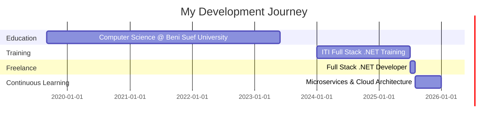

<div align="center">

# 🚀 Mohamed Abdallah Zaki Full Stack .Net


[](https://www.linkedin.com/in/mohamed-abdallah-zaki-4a92ab229/)
[](mailto:mohamedabdallah1542001@gmail.com)


</div>

## 🧑‍💻 About Me

```csharp
public class Developer 
{
    public string Name { get; set; } = "Mohamed Abdallah Zaki";
    public string Location { get; set; } = "Cairo, Egypt 🇪🇬";
    public string Role { get; set; } = "Full Stack .NET Developer";
    public string[] Specialties { get; set; } = new[] 
    { 
        "Backend Architecture", 
        "Microservices Design",
        "RESTful APIs",
        "Frontend Development" 
    };
    
    public void SayHi() 
    {
        Console.WriteLine("Thanks for dropping by! Let's build something amazing together!");
    }
}
```

<div align="center">

### 💡 Current Focus
🔭 Building distributed microservices systems  
🌱 Learing Azure Cloud 
👯 Looking to collaborate on open-source .NET projects  
💬 Ask me about C#, ASP.NET Core, Angular, or Microservices  
⚡ Fun fact: I debug faster with coffee ☕  

</div>

---

## 🛠️ Tech Arsenal

<div align="center">

### Backend Powerhouse


### Database Management


### Frontend Magic


### Microservices & Messaging


### Cloud 


### Design Patterns & Architecture


</div>


## 📊 GitHub Analytics

<div align="center">


</div>

<div align="center">

[](https://git.io/streak-stats)

</div>

<div align="center">

[](https://github.com/ashutosh00710/github-readme-activity-graph)

</div>

<div align="center">


</div>

---

## 🚀 Featured Projects

<div align="center">

<table>
<tr>
<td width="50%">

### 🏢 Microservices E-Commerce
<a href="https://github.com/mohamedabdallahzaki"></a>

**Stack:** ASP.NET Core • Docker • RabbitMQ • Ocelot

✨ Database-per-Service pattern  
✨ API Gateway with Ocelot  
✨ Async messaging with RabbitMQ  
✨ Containerized with Docker  

</td>
<td width="50%">

### 🎓 Educational Platform
<a href="https://github.com/mohamedabdallahzaki"></a>

**Stack:** ASP.NET Core • Angular • JWT • SQL Server

✨ Full-stack platform  
✨ JWT authentication  
✨ Real-time video streaming  
✨ Dynamic admin dashboard  

</td>
</tr>

<tr>
<td width="50%">

### 🎬 Movie Web App
<a href="https://github.com/mohamedabdallahzaki"></a>

**Stack:** Angular • TypeScript • HTML5 • CSS3

✨ Responsive design  
✨ API-ready architecture  
✨ Component-based structure  
✨ Modern UI/UX  

</td>
<td width="50%">

### 🛒 Buy.Nest E-Commerce
<a href="https://github.com/mohamedabdallahzaki"></a>

**Stack:** HTML • CSS • JavaScript • REST API

✨ Fully responsive  
✨ Real-time product fetching  
✨ Interactive UI components  
✨ Mobile-friendly  

</td>
</tr>

<tr>
<td width="50%">

### 👥 HR Management System
<a href="https://github.com/mohamedabdallahzaki"></a>

**Stack:** ASP.NET MVC • Entity Framework • SQL

✨ Full CRUD operations  
✨ Role-based access  
✨ Data-driven views  
✨ Responsive UI  

</td>
<td width="50%">

### 📝 More Projects
<br>

**🔗 [View All Repositories](https://github.com/mohamedabdallahzaki?tab=repositories)**

Explore more of my work including:
- Web APIs
- Frontend Projects
- And much more!

</td>
</tr>
</table>

</div>

---

## 💼 Professional Experience

<div align="center">



</div>

---

## 🎯 Skills Matrix

<div align="center">

| Category | Skills | Proficiency |
|----------|--------|-------------|
| **Backend** | C#, ASP.NET Core, Web API, MVC | ████████████████████ 90% |
| **Database** | SQL Server, Entity Framework, LINQ | ████████████████░░░░ 85% |
| **Frontend** | Angular 17+, TypeScript, JavaScript | ████████████████░░░░ 85% |
| **Microservices** | Docker, RabbitMQ, gRPC, CQRS | ███████████████░░░░░ 80% |
| **Cloud** | Azure Services, DevOps | ███████████████░░░░░ 75% |
| **Tools** | Git, Postman, Visual Studio | ████████████████████ 90% |

</div>

---

## 🏆 Achievements & Certifications

<div align="center">

| 🎓 Certification | 📅 Date | 🏢 Institution |
|-----------------|---------|---------------|
| **Full Stack .NET Web Development** | July 2025 | ITI (Information Technology Institute) |
| **Computer Science Degree** | June 2023 | Beni Suef University |

### 📚 Course Highlights
`JavaScript` • `HTML5 & CSS3` • `Bootstrap` • `Angular` • `SQL` • `Entity Framework` • `LINQ` • `Final Project`

</div>

---

### 📈 Contribution Activity

<!--
Note: To enable the snake animation, you need to:
1. Go to your profile repository settings
2. Enable GitHub Actions
3. Create .github/workflows/snake.yml with the snake generation action
For now, this section shows your contribution calendar
-->


---

## 💪 Soft Skills

<div align="center">

| 🧩 Problem Solving | 👥 Leadership | 🎤 Presentation | 🤝 Teamwork |
|:------------------:|:-------------:|:---------------:|:-----------:|
| ⭐⭐⭐⭐⭐ | ⭐⭐⭐⭐⭐ | ⭐⭐⭐⭐⭐ | ⭐⭐⭐⭐⭐ |

**🔥 Eager to Learn** • **💡 Self-Motivated** • **🌍 Bilingual: Arabic (Native) • English (Intermediate)**

</div>

---

## 🌐 Let's Connect!

<div align="center">

[](https://www.linkedin.com/in/mohamed-abdallah-zaki-4a92ab229/)
[](mailto:mohamedabdallah1542001@gmail.com)
[](https://github.com/mohamedabdallahzaki)

📍 **Location:** Cairo, Egypt  
📱 **Phone:** +01022083479  
💼 **Open for:** Freelance Projects • Full-time Opportunities • Collaborations

</div>

---

<div align="center">

### 💭 Philosophy

> **"Strive for progress, not perfection."**
> 
> *— Building better software, one commit at a time*

---

### 📊 Profile Stats


---


### ⭐ If you find my work interesting, don't forget to star my repositories!

**Made with ❤️ by Mohamed Abdallah Zaki**

</div>
